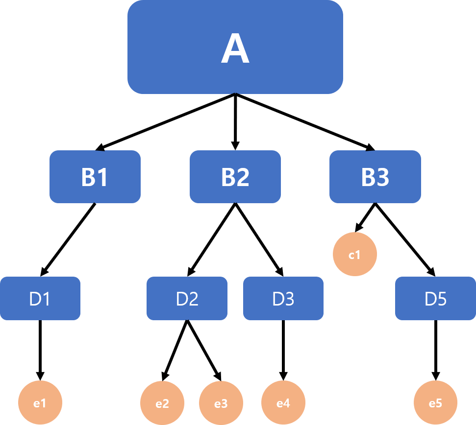
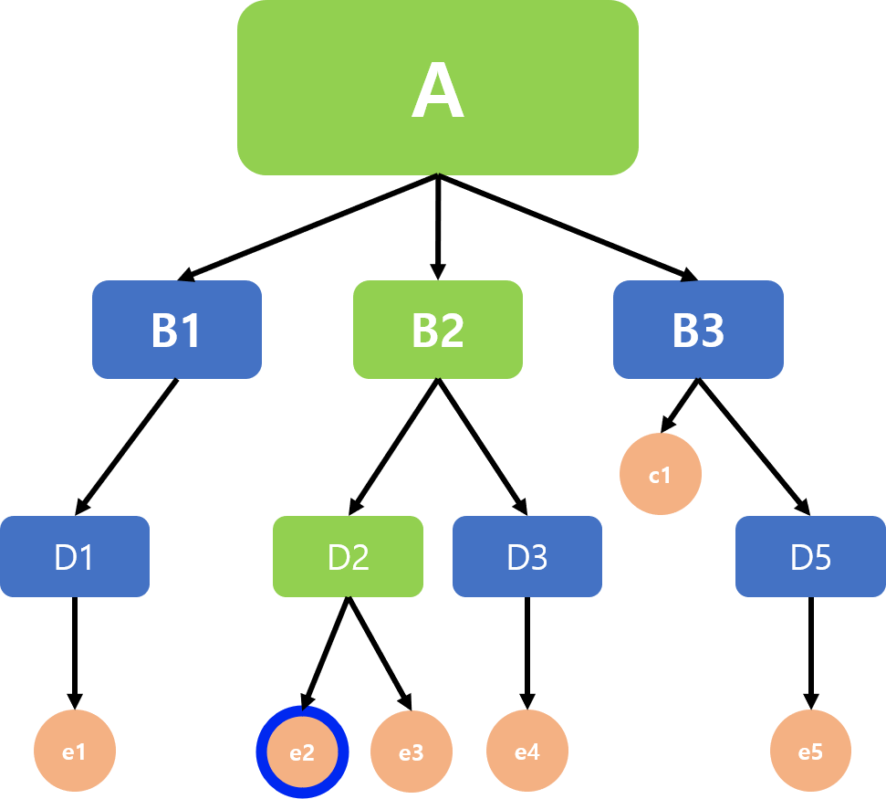
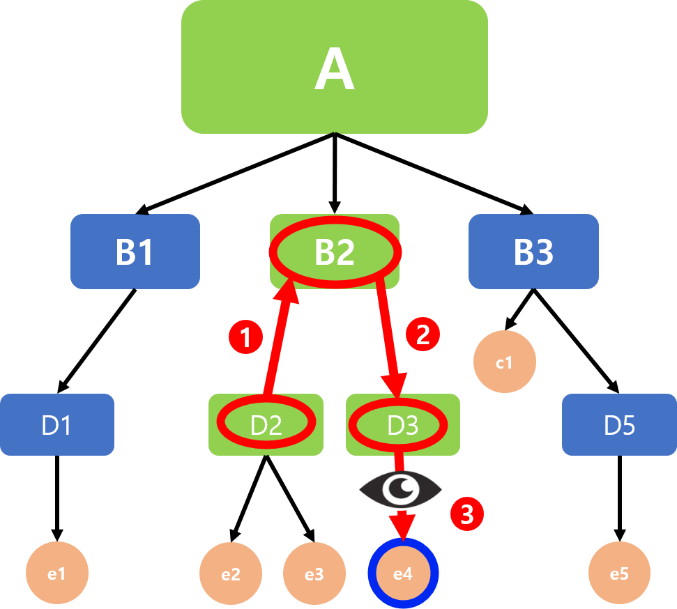

# 02. 기본적인 태그들
HTML을 다루기위해 '태그를 외우는 것'은 옳지 않다고 말했지만, *그럼에도 불구하고,* 정말 너무 기본적이어서 HTML을 다루는 사람들이라면 당연히 알아보는 태그들이 있어요. 이런 쉬운 태그들을 먼저 만나는 게 HTML을 시작하기에도 좋으니, 몇 개 소개할게요.

## `<hn>` 헤더 태그들
`<hn>`에서 n 자리에는 1~6까지의 숫자들이 들어가요. 숫자가 <u>커질수록</u> 헤더(제목)의 크기는 <u>작아</u>진답니다! 서로 반대라고 생각하기보다는, '1번째 제목', '2번째 제목'과 같이 생각하는 게 조금 더 도움될거에요. `<h1>`으로 감싸진 제목은 첫 번째 수준의 제목이니, 가장 크다는 느낌으로 알아두는 거죠.  
  
예시: [페이지로 보기](https://hajunmyoung.github.io/study_b/src/languages/html_css/examples/02_001.html)
```html
<!DOCTYPE html>
<html>

<head>
    <title>헤더 예시</title>
</head>

<body>
    <h1>h1 수준의 제목이에요.</h1>
    <h2>h2 수준의 제목이에요.</h2>
    <h3>h3 수준의 제목이에요.</h3>
    <h4>h4 수준의 제목이에요.</h4>
    <h5>h5 수준의 제목이에요.</h5>
    <h6>h6 수준의 제목이에요.</h6>
    <h7>h7 수준의 제목은 없어요.</h7><br>
    아무런 태그를 씌우지 않은 일반 텍스트에요.
</body>

</html>
```
바로 새 창에서 보는 것도 좋지만, 한번 쯤 직접 코딩해보세요!  
:::warning 아, 위 예시 코드에서 br 태그는 어떤 역할을 수행하냐고요?
그 태그는 '줄바꿈'을 시키는 태그에요. 줄바꿈을 바로 수행하는 태그이기 때문에, 일반적인 태그와는 달리 끝태그 `</br>`을 쓰지 않아요. `<br>`태그 하나로 이미 '줄바꿈'이 된 거에요.
:::
  
이 예시를 통해 알 수 있는 헤더 태그의 특징에는 몇 가지가 있죠.

- 헤더 태그는 1~6까지의 수준을 제공해요
- 6번까지 가면, 일반 텍스트보다도 글씨 크기가 작기도 해요.
- 모든 헤더들은 기본적으로 Bold(굵게) 처리가 되어있어요.
- 헤더는 별도로 줄바꿈(`<br>`)을 하지 않아도 알아서 줄을 바꿔요.

## `<u>`, `<i>`, `<b>` 글자 효과주기
각각의 태그 `<u>`, `<i>`, `<b>`는 <u>underline(밑줄)</u>, <i>italic(이탤릭체)</i>, <b>bold(볼드)</b>에서 따온 알파벳이에요. 이 문장에서 보이는 것과 같이 각각 해당하는 효과로 글자를 꾸며주죠.  

페이지로 보려면 [여기로 오세요](https://hajunmyoung.github.io/study_b/src/languages/html_css/examples/02_002.html)
```html
<!DOCTYPE html>
<html>

<head>
    <title>글자효과 예시</title>
</head>

<body>
    <u>UNDERLINE, 밑줄 효과</u><br>
    <i>ITALIC, 이탤릭체(기울임 효과)</i><br>
    <b>BOLD, 볼드체(굵은 글씨)</b><br>
</body>

</html>
```

## `<p>` 문단 나누기
`<p>` 태그는 [01.HTML의 기본 구조](./01_basicStructure.html)의 예시에서도 나온 태그죠. 말 그대로 '문단'을 설정하고 나누는 역할을 수행해요.

나눠진 문단은 자동으로 줄바꿈이 되기도 하죠: [새 창에서 보기](https://hajunmyoung.github.io/study_b/src/languages/html_css/examples/02_003.html)
```html
<!DOCTYPE html>
<html>

<head>
    <title>문단예제01</title>
</head>

<body>
    <p>이 문단은 첫 번째 문단이에요. 이번에는 br태그로 줄바꿈을 하지 않을 거에요.</p>
    <p>하지만 이렇게 새로운 '문단'으로 감싸면 자동으로 줄이 바뀐답니다.</p>
</body>

</html>
```

그런데, 단순히 줄바꿈을 위해서 이 태그를 사용하냐구요? 음...그것보다는 특정 영역을 쉽게 컨트롤하기 위해서 자주 쓰죠. 무슨 말이냐면,  

[새 창에서 예시 보기](https://hajunmyoung.github.io/study_b/src/languages/html_css/examples/02_004.html)
```html
<!DOCTYPE html>
<html>

<head>
    <title>문단예제01</title>
</head>

<body>
    <p style="text-align: left; font-size:30px;">이렇게</p>
    <p style="text-align: center; font-size:30px;">문단 정렬을</p>
    <p style="text-align: right; font-size:30px;">적용하거나</p>
    <p style="text-align: center; color: red; font-size:30px;">색깔,</p>
    <p style="text-align: center; font-family: '궁서체'; font-size:30px;">
        또는 글꼴을 적용하기도 해요.
    </p>
    <br>
    <p style="text-align: center; font-family: '궁서체'; color: red; font-size:30px;">
        물론 이것저것 다 때려넣는 것도 가능하죠.
    </p>
</body>

</html>
```

이와 비슷한(혹은 같은) 효과를 내는 다른 태그들도 존재해요. html의 태그들이 서로 완전히 독립적이지는 않거든요. 하지만 아직은, 이 정도까지만 알아두고... 차차 배워가면서 다른 태그들도 공부해봅시다!

### +α) style 속성
style 속성으로 부여할 수 있는 요소들은 몇 가지가 있어요. 위 예시 태그에서처럼 태그를 나타내는 꺽은괄호 `<>`안에서 `style=""`을 쓰고, 큰따옴표 안에 여러가지를 써 넣으면 된답니다. '부여할 효과 종류: 내용'과 같이 콜론으로 설명한다는 것, 부여할 효과와 효과 사이는 세미콜론으로 구분한다는 것만 기억하세요.
:::warning 아, 한 가지 더요.
이거 CSS에요.
:::
- `text-align` : 문단 정렬을 쓸 수 있어요.
    - 아주 직관적이게도 `left`로 왼쪽 정렬, `center`로 가운데 정렬, `right`로 오른쪽 정렬이 돼요.

- `font-size` : 글자 크기를 정할 수 있어요.
    - 숫자만 써도 되고, `pt`, `px`, `mm` 등 다양한 단위를 붙일 수도 있죠.

- `color` : 말 그대로 색깔을 부여할 수 있어요.
    - `#3F246A`처럼 RGB 코드를 쓸 수도 있고, 네임드 컬러의 경우 색상이름을 말해줘도 돼요.
    - 네임드 컬러의 종류는...[무지막지하게 많아요!](./namedColors.html)

- `font-family` : 글꼴을 부여할 수 있어요.
    - html에서 지원하는 기본 글꼴들에는 [몇 가지가 있어요.](./htmlFonts.html)

## `<a href=>` 하이퍼링크 걸기
하이퍼링크를 걸 수 있는 아주 쉬운 태그에요.  

[새 창에서 예시 보기](https://hajunmyoung.github.io/study_b/src/languages/html_css/examples/02_005.html)
```html
<!DOCTYPE html>
<html>

<head>
    <title>하이퍼링크 예제</title>
</head>

<body>
    <a href="https://hajunmyoung.github.io/study_b/">여기를 눌러 접속하세요</a>
</body>

</html>
```
말 그대로, `href=""`에 넘겨준 링크로 연결하는 하이퍼링크를 걸 수 있어요. 노출되는 텍스트는 `<a>` 태그 사이에 입력된 값으로 결정되죠.  

여기서, `href=""`에게 준 링크의 형태는 접속되는 페이지를 아주 직접적으로 간섭해요. ***http://나 https://*** 로 시작된다면, 새 창을 열어서 해당 링크로 접속하게 하는 아주 일반적인 하이퍼링크가 생성되죠. 그러나, ***바로 시작하는 주소*** 는 현재 페이지를 기준으로 이동하게 돼요.  
예를 들어서,
```html
<a href="02_basicTags.html#a-href-하이퍼링크-걸기">여기를 눌러보세요</a>
```
이렇게 링크를 넘겨주면: <a href="02_basicTags.html#a-href-하이퍼링크-걸기">여기를 눌러보세요</a>  
다녀오셨나요? 맞아요. 현재 주소(루트)를 기준으로 href가 받은 링크를 찾아요.  

이 태그를 통해 동작하는 하이퍼링크는 **쉘 에서의 cd 명령어**와 매커니즘이 같아요.
:::details 그 매커니즘을 이용하면 이렇게 링크를 짤 수 있죠.(꼭 볼 필요는 없어요)
자, 먼저 여러분이 A라는 사이트에 접속했다고 가정해볼게요. 그 사이트는 이렇게 생겼어요:  
<table><tr style="border: 0px;"><td style="width: 655px; text-align:center; border: 0px;"></td></tr></table>

그리고 여러분은 이 사이트에서 `A/B2/D2/e2` 페이지를 보고 있어요:
<table><tr style="border: 0px;"><td style="width: 655px; text-align:center; border: 0px;"></td></tr></table>

여기서, 여러분이 있는 위치는 어디인가요? `A/B2/D2/e2`인가요? 아니에요. 여러분은 `A/B2/D2/`디렉토리에 있고, 거기에 있는 e2라는 파일을 보고 있는 중이죠. 그래서, 그 옆 페이지인 `A/B2/D2/e3`로 넘어가는 건 그냥 해당 페이지를 '읽기만'하면 돼요. 이걸 위한 코드는 다음과 같이 짜여지요:
```html
<a href="e3">링크</a>
```

그렇다면, `/D3/` 디렉토리에 있는 `e4` 파일을 읽고싶다면, e4페이지를 보고 싶다면 링크를 어떻게 짜야 할까요? 순서를 먼저 파악해 볼게요:
<table><tr style="border: 0px;"><td style="width: 655px; text-align:center; border: 0px;"></td></tr></table>
1. 먼저, 현재 있는 디렉토리 `/D2/`의 상위 디렉토리인 `/B2/`로 이동해요.
1. 그리고, `/B2/`의 하위 디렉토리이자 목적지인 `/D3/`로 가요.
1. 거기서 파일 `e4`를 읽어요.

이 순서를, 상위 디렉토리가 `../`로 이동된다는 것에 유의하여 그대로 옮기면 다음과 같은 코드가 완성돼요:
```html
<a href="../D3/e4">링크</a>
```
여기에 해당하는 실전 예시를 하나 들어볼까요? 이건 제 블로그 구조 중 일부에요:
```
languages에 있는 타 언어 문서들 중 README.md 외의 내용이 추가되는 대로 예시 들기
```
:::

## `` 이미지 넣기
이미지를 문서에 넣게 해 주는 태그에요. 이 ``태그 말고도 같은 기능을 수행할 수 있는 태그들(ex. `<embed>`)이 있지만, 이미지를 넣는 게 목적이라면 그냥 ``태그로 해당 작업을 수행하는 게 나을거에요.

[새 창에서 예시 보기](https://hajunmyoung.github.io/study_b/src/languages/html_css/examples/02_006.html)
```html
<!DOCTYPE html>
<html>

<head>
    <title>이미지태그 예시</title>
</head>

<body>
    기본적으로 이미지가 이렇게 나와요.<br>
    <br>
    이미지의 크기를 조절할 수 있어요.<br>
    <br>
    이미지 출력에 문제가 있다면 alt 속성에 준 텍스트가 출력돼요.<br>
    <br>
</body>

</html>
```
``태그는 필수로 가지는 `src`속성이 있고, 선택사항으로 끼워넣을 수 있는 속성들(`alt`, `width`, `height`)이 있어요. 각각 다음과 같은 기능을 수행하죠.

- `<src>` : 말 그대로 이미지가 어디에 있는지 소스를 알려줘야 해요. 그래야 브라우저가 읽어올 수 있을 테니까요.
    - 위치는 이미지 링크 주소, 상대 주소(로컬 주소) 등이 될 수 있어요.
- `alt` : 이미지 출력에 문제가 생겼을 때 대체 텍스트를 입력해 줄 수 있어요.
- `width` : 이미지의 너비를 임의지정할 수 있어요.
- `height` : 이미지의 높이를 임의지정할 수 있어요.

## 요약 및 점검 퀴즈
고생하셨어요, 기본이라고는 하지만 결코 내용이 적지 않았던 것 같네요 :smiley:  
이 챕터에서 다룬 태그는 5종류였어요.  
1. 헤더를 쓸 수 있는 `<h_>` 태그
1. 글자에 <u>밑줄</u>, <i>기울임</i>, <b>굵게</b> 효과를 부여하는 `<u>`, `<i>`, `<b>` 태그
1. 문단을 지정하고 컨트롤하는 `<p>` 태그
1. 하이퍼링크를 거는 `<a href="">` 태그
1. 이미지를 넣고, 조절하고, 오류에 대처하는 `` 태그  

이 각각 태그와 다룬 내용들에 대해 짧은 퀴즈를 준비했으니, 한 번 풀어보세요!

:::quiz 헤더 태그는 몇 가지 수준을 제공하고, 누가 가장 큰가요?
:::details 정답
`<h1>`부터 `<h6>`까지 총 6가지 수준을 제공하고, `<h1>`이 첫 번째 제목으로 가장 커요.
:::

:::quiz 글자에 효과를 주는 태그들은 어떤 의미를 가지고 있나요?
`<u>`, `<i>`, `<b>` 태그 각각의 의미요.
:::details 정답
각각 Underline의 u, Italic의 i, Bold의 b를 의미해요.
:::

:::quiz 다음 링크를 코딩해보세요.
<a href="https://google.com">여기를 눌러 구글로 접속하세요.</a>
:::details 정답
```html
<a href="https://google.com">여기를 눌러 구글로 접속하세요.</a>
```
:::