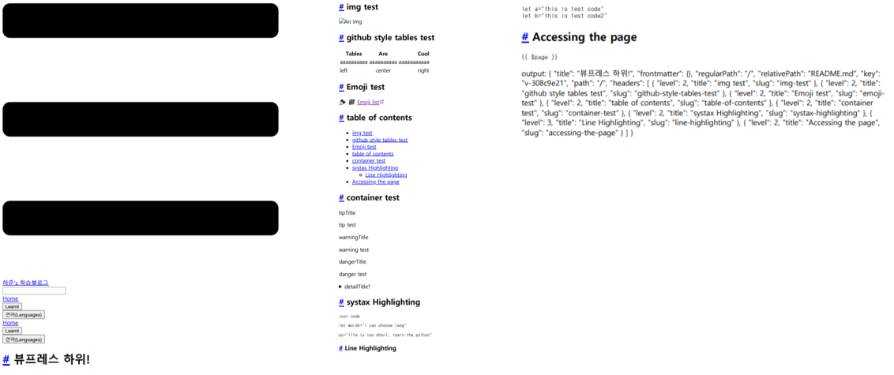

# 몇 가지 오류와 대처방법
여기서는 뷰프레스 준비를 따라 열심히 설치하고, 명령하고...하다가 뭔가 뜻대로 되지 않는 경우들을 모아놓을 거에요. 대처방안도 함께 있을거니, 생각한 대로 움직여지지 않는다면 이 내용들을 한 번 살펴보세요.  
  
:::tip 여러분의 제보를 기다립니다.
제가 겪지 못한 오류들과 해결한 방법을 제보해주세요.  
아주 사소한 오류도 좋고, 심각한 오류도 좋아요.  
해결방법을 찾으셨다면 베스트, 해결방법이 아직 찾아지지 않았어도 일단 제보해주세요.
  
메일제목은... [뷰프레스][오류제보] 정도로 시작하면 되지 않을까요?
:::

## 파워쉘 보안 문제
저는 CMD 대신 파워쉘로 npm, yarn 등을 설치하고 작업했어요.  
yarn을 설치하는 데 까지는 성공했는데, `yarn -version`을 통해서 잘 되었나 확인하려고 하니 뜬금없이
```
yarn : 이 시스템에서 스크립트를 실행할 수 없으므로 
C:\Users\Administrator\AppData\Roaming\npm\yarn.ps1 파일을 로드할 수 없습니다.
자세한 내용은 about_Execution_Policies(https://go.microsoft.com/fwlink/?LinkID=135170)
를 참조하십시오.

위치 줄:1 문자:1 + yarn -v + ~~~~ + CategoryInfo 
: 보안 오류: (:) [], PSSecurityException + FullyQualifiedErrorId : UnauthorizedAccess
```
이런 오류가 뜨는거에요. 어떻게 해야 하나...하다가 [확장형 뇌 저장소님의 글]( https://extbrain.tistory.com/118)을 따라해 해결했답니다.  
  
핵심은, **파워쉘에서 보안 문제로 yarn이 무언가를 실행할 수 없게 막은 것** 이었어요.

### 해결
***
1. 먼저, 파워쉘을 **관리자 권한** 으로 실행해 줍니다.
1. 다음의 명령어를 입력해, 파워쉘 정책이 yarn을 제한시키는지 아닌지 알아봅니다.
```shell
$ ExecutionPolicy
```
(대소문자는 중요하지 않아요)  
   - 아래 그림처럼 'Restricted'라고 뜨면, 보안 정책 문제가 맞습니다.  


3. 이제 보안 정책을 풀어줍니다.
```shell
$ Set-ExecutionPolicy unRestricted
```
중간에 정말 변경할 건지 묻는 질문에 'y'로 동의해주시는 거 잊지 말구요.  


4. 이제, 정말 변경되었는지 확인해봅니다.
```shell
$ ExecutionPolicy
```
  
  
이제 다시, `yarn -version`을 실행해 잘 되는지 확인해보세요!

## 베이스 루트 문제(dev정상, build실패)
뷰프레스 블로그를 만들다보면, 베이스를 지정하는 파트가 있습니다.  
베이스는 '여러분의 블로그가 시작되는 기반 주소'를 의미하고, 제 블로그의 경우 `/study_b/` 가 여기에 해당되죠. 이 베이스 주소는, 레포지토리 이름과 일치하거나 없어야 한다는 점 주의하시기 바랍니다.  
:::tip 베이스가 없는 경우와 있는 경우의 차이
없다면 < username >.github.io/ 에 블로그가 디플로잉 되고,  
베이스를 지정했다면 < username >.github.io/< base >/에 블로그가 디플로잉이 이루어집니다.
:::
  
문제는, dev에서는 문제 없이 의도한 페이지가 구성되는데 build(혹은 deploying)를 하니 레이아웃이 완전히 깨진(기본 테마가 전혀 적용되지 않은) 결과물이 출력될 때가 있다는 겁니다. 제 경우, 세 개의 검정 사각형이 반기는 페이지가 구성되었어요.  
  

  
해당 페이지가 빌드 실패가 아닌 '레이아웃의 깨짐'이라고 판단한 건, 페이지를 이루고 있는 내용들인 *블로그 이름, h1 헤더 제목, 내용의 구성* 들은 제가 작성한 내용 그대로 출력되었기 때문입니다. 그러나 뷰프레스의 기본 테마도 적용되지 않았고, 내용들이 정리되어있지 않은, 생으로 메모장에 html을 작성한 듯한 결과물이었죠.
  
### 해결
***
해결법을 찾아 헤메이며 스트레스 받았지만, 의외로 간단하게 해결되었습니다. :grimacing:   
config.js 파일에 있는 베이스 코드가
```js
module.exports={
    base : '/studyb/',
    ~~~
   }
```
라고 되어있는데, (당시 레포지토리 이름은 studyB)  
이를 아래와 같이 수정하고 나서야, 제대로 된 페이지를 deploying할 수 있었어요.
```js
module.exports={
    base : '/studyB/',
    ~~~
   }
```
네 맞아요. 베이스 코드는 무려 대소문자를 구분하더라구요.  
:::tip 이 오류를 해결하면서
아, 이래서 레포지토리 이름에 대문자를 쓰지 말라고 하는구나...하고  
깨달으며 레포지토리 이름을 `study_b'로 바꾸게 되었죠.
:::
  
사실, 뷰프레스 테마가 적용되지 않고 세 개의 검은 사각형으로 페이지가 시작되는 오류는 원인이 꽤 다양하고, 결과로는 흔한 문제 같아요. 원인이 무엇인지는 정확히 몰라도, 논리 오류의 결과로 자주 보게 되는 게 아닐까 싶다는거죠. 그도 그럴게, vuejs 공식 깃허브에서도 ['Three black rectangle' 이 나온다는 이슈](https://github.com/vuejs/vuepress/issues/575)가 꽤 흔해요ㅋㅋ.  
> 참고로, 저 링크에 있는 이슈는 이 오류를 해결하는 데 아무런 도움이 되지 않았습니다 :grimacing:

## 플러그인 적용 실패 문제
블로그를 작성하면서, 몇 가지 플러그인을 넣으려고 시도 해 보았지만 제대로 되지 않았어요.  
제가 처음 적용하고자 했던 플러그인은 "back-to-top" 플러그인인데, 이름 그대로 페이지를 일정 이상 스크롤하면 화면 우하단에 페이지 꼭대기로 갈 수 있는 버튼을 제공하는 플러그인이에요.  
  
이 플러그인은 뷰프레스 공식 플러그인(Official Pulugins)이어서, [가이드가 친절하게 제공되어](https://vuepress.vuejs.org/plugin/official/plugin-back-to-top.html#vuepress-plugin-back-to-top) 있어요.  
그다지 어려운 가이드가 아닌데도, back-to-top 버튼은 절대 생기지를 않더라구요... :sob:
  
### 해결
***
이 오류의 문제점은 '구글 애널리틱스'를 적용하고자 하면서 찾게 되었어요. 굉장히 허무한 원인이었죠.  

뷰프레스 블로그에서의 플러그인은  **1)npm install이나 yarn add를 통해 필요한 파일을 설치(install)** 하고, **2)`config.js` 파일의 수정을 통해서 이를 적용**하는 두 단계를 거쳐서 설치하는 게 일반적이에요.  

:::details 제 경우, 플러그인 '설치'는 성공적이었어요.
back-to-top 플러그인의 설치는 공식 가이드에 따라
```shell
yarn add -D @vuepress/plugin-back-to-top
# OR npm install -D @vuepress/plugin-back-to-top
```
를 통해서,  
  
google-Analytics 플러그인은
```shell
yarn add -D @vuepress/plugin-google-analytics
# OR npm install -D @vuepress/plugin-google-analytics
```
를 통해서 설치했답니다.
:::

문제점은 `config.js`의 수정에서 발견되었죠.

플러그인들을 적용할 때 `config.js`의 구성은 다음과 같아야 해요:
```js
module.exports={
   //some codes...
   plugins=[
      'Name-of-Plugin',
      [
         'some-plugins-have-children',
         {
            //like this
            'ga' : 'UA-00000000-0'
         }
      ]
   ]
   //some codes...
}
```
하지만, 제 `config.js`를 유심히 살펴보니, 이것저것 셋팅한다고 하다가 어처구니 없는 실수를 했더군요.
```js{7-11}
module.exports={
   base : '/study_b/',
   locales : {
      //...
   },
   //...
   themeConfig:{
      plugins=[
         ...
      ]
   }
   //...
}
```
**맞아요, 놀랍게도 `plugins=[]`를 `themeConfig:{}` 안에 넣어버렸어요.**  

...그리고 그걸 꺼내줬더니 짜잔! 해결되었답니다~...ㅎ